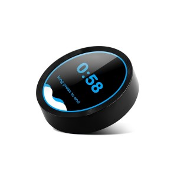
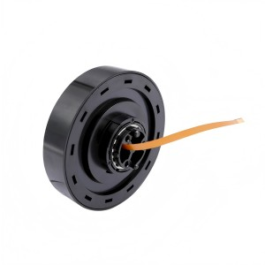
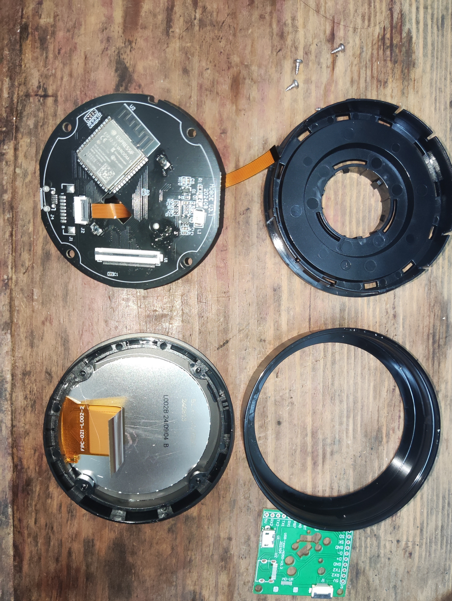
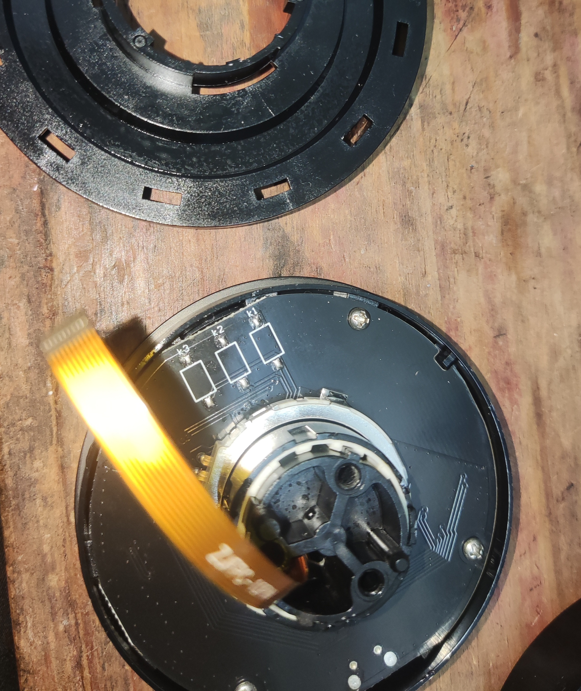
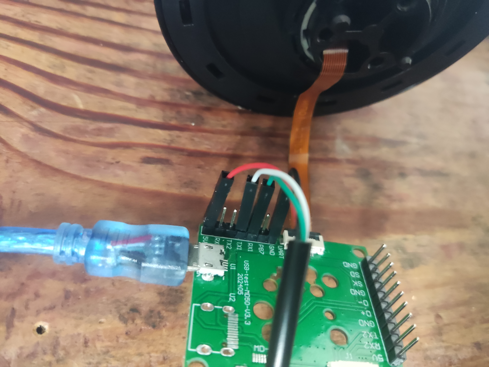
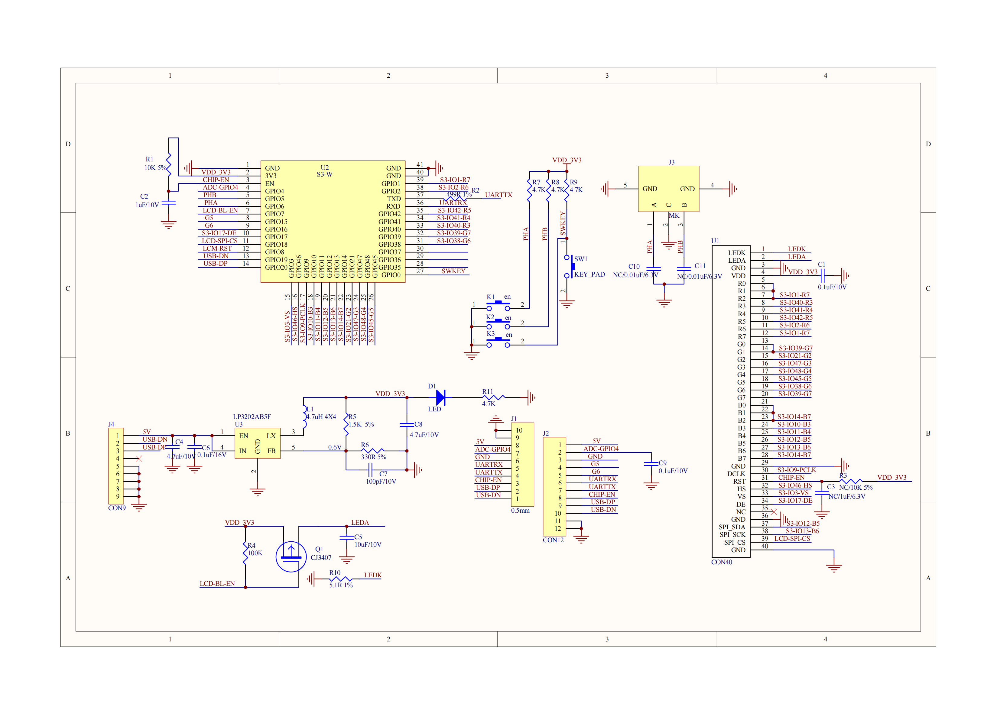

<h1 align = "center">UEDX48480021-MD80ESP32_2.1inch-Knob-Display</h1>

<p align="center" width="90%">
    
    
</p>

## **English | [中文](./README_CN.md)**

## ⚠️ Notes
**Hardware Differentiation**  
   This repository is for **non-touch version** knob hardware. For touch-enabled version of the similar knob, refer to:  
   [UEDX48480021-MD80ESP32-2.1inch-Touch-Knob-Display](https://github.com/VIEWESMART/UEDX48480021-MD80ESP32-2.1inch-Touch-Knob-Display)  
   - **Key Differences**:
     - Touch vs. Non-touch
     - Different display driver chips (GC9503CV vs. ST7701S)
     - **Firmware and libraries are NOT interchangeable**

## QuickStart

### Arduino example project 
1. Install [Arduino](https://www.arduino.cc/en/software) and open it.

2. Open the `example` directory in the project folder, select the `SquareLinePorting` project folder, and then open the `SquareLinePorting.ino` file to open the Arduino IDE project workspace.

3. Open the `Tools` menu in the upper right -> select `Board` -> `Board Manager`. Search for `esp32` and download the board files authored by **Espressif Systems** (It's recommended to use 3.0.7 version, newer versions maybe not work.).
   After installation, go back to the `Board` menu, and under the `esp32` category, select the `ESP32S3 Dev Module` board.

4. In the `Tools` menu, check and select the correct settings as shown in the table below.

#### ESP32-S3

|          Setting         |              Value              |
| :----------------------: | :-----------------------------: |
|           Board          |        ESP32S3 Dev Module       |
|       CPU Frequency      |          240MHz (WiFi)          |
|     Core Debug Level     |               None              |
|      USB CDC On Boot     |             Enabled             |
|      USB DFU On Boot     |             Disabled            |
|       Events Run On      |              Core 1             |
|        Flash Mode        |            QIO 80MHz            |
|        Flash Size        |           16MB (128Mb)          |
|      Arduino Runs On     |              Core 1             |
| USB Firmware MSC On Boot |             Disabled            |
|     Partition Scheme     | 16M Flash (3MB APP/9.9MB FATFS) |
|           PSRAM          |            OPI PSRAM            |
|        Upload Mode       |        UART0/Hardware CDC       |
|       Upload Speed       |              921600             |
|         USB Mode         |      Hardware CDC and JTAG      |

5. In the `Tools` -> `Port` menu, select the correct port.

6. Open the menu bar **[File](image/6.png)** -> **[Preferences](image/6.png)**, find **[Sketchbook location](image/7.png)**,
   copy all library files and folders from the **Libraries** folder in the project directory into the **libraries** folder in this directory (the default location on Windows is `C:\Users\<username>\Documents\Arduino\libraries`).

7. Click the <kbd>[√](image/8.png)</kbd> button in the upper right corner to compile.
   If the compilation is successful, connect the microcontroller to the computer with a data cable,
   then click the <kbd>[→](image/9.png)</kbd> button in the upper right corner to upload the program.

## Reference: Hardware Details & Recovery

### Internal Structure Reference
For hardware debugging or customization, below are the internal component references:

<p align="center" width="100%">
    
    
</p>

---

### TTL Recovery Mode
If the device becomes unresponsive due to firmware issues, use TTL-to-USB converter (e.g., CH340G module) for recovery:

 **Wiring Guide**:  
   Follow the pin mapping shown below:  
   <p align="center" width="60%">
       
   </p>

 **Recovery Steps**:
   - Connect TTL module to PC and open serial terminal (115200 baud)
   - **Hold the center knob button** (BOOT/IO0) while powering on the board

> 💡 **Note**: The center knob button is hardwired to `IO0` for forced download mode.


## References: Introduction to the Repository Directory

```
├── Libraries                 Library files required for the Arduino example  
├── Schematic                 The circuit schematic of the product   
├── examples                  Sample files, including the IDF framework and the Arduino framework
├── image                     Product or sample project related images
├── information               Product specifications, including the IC or peripherals involved
├── tools                     Burn tool and image conversion tool
└── README.md                 This is the file you are currently reading,Give a brief introduction to the product
```

## Version iteration:
| Development board Version | Screen size | Resolution | Update date | Update description |
| :-----------------------: | :---------: | :--------: | :---------: | :----------------: |
|    UEDX48480021-MD80E     |  2.1-inch   |  480*480   | 2024-07-23  |  Original version  |

## PurchaseLink

|      Product       |    SOC    | FLASH |     PSRAM      |                                                          Link                                                           |
| :----------------: | :-------: | :---: | :------------: | :---------------------------------------------------------------------------------------------------------------------: |
| UEDX48480021-MD80E | ESP32S3R8 |  16M  | 8M (Octal SPI) | [VIEWE Mall](https://viewedisplay.com/product/esp32-7-inch-800x480-rgb-ips-tft-display-touch-screen-arduino-lvgl-uart/) |

## Directory
- [Describe](#describe)
- [Module](#module)
- [PinOverview](#pinoverview)
- [QuickStart](#quickstart)
- [FAQ](#faq)
- [Schematic](#Schematic)
- [Information](#information)
- [DependentLibraries](#dependentlibraries)

## Describe

UEDX48480021-MD80ESP32_2.1inch-Knob-Display is a development board with square 2.1-inch 480 * 480 resolution display, based on ESP32S3, suitable for the development of microcontroller projects with display.


## Module

### 1.MCU

* Chip: ESP32-S3-R8
* PSRAM: 8M (Octal SPI) 
* FLASH: 16M
* For more details, please visit[Espressif ESP32-S3 Datashee](https://www.espressif.com.cn/sites/default/files/documentation/esp32-s3_datasheet_en.pdf)

### 2. Screen

* Size: 2.1-inch IPS screen
* Resolution: 480x480px
* Screen type: IPS
* Driver chip: GC9503CV
* Compatibility library:  ESP32_Display_Panel
* Bus communication protocol: 3 Wire SPI-RGB 24bits

### 3. Touch

* Chip: No touch

## PinOverview

| IPS Screen Pin | ESP32S3 Pin |
| :------------: | :---------: |
|       DE       |    IO17     |
|     VSYNC      |     IO3     |
|     HSYNC      |    IO46     |
|      PCLK      |     IO9     |
|     DATA0      |    IO10     | //B
|     DATA1      |    IO11     |
|     DATA2      |    IO12     |
|     DATA3      |    IO13     |
|     DATA4      |    IO14     |
|     DATA5      |    IO21     |  //G
|     DATA6      |    IO47     |
|     DATA7      |    IO48     |
|     DATA8      |    IO45     |
|     DATA9      |    IO38     |
|     DATA10     |    IO39     |
|     DATA11     |    IO40     |  //R
|     DATA12     |    IO41     |
|     DATA13     |    IO42     |
|     DATA14     |     IO2     |
|     DATA15     |     IO1     |
|     SPI_CS     |    IO18     |
|    SPI_SCK     |    IO13     |
|    SPI_SDA     |    IO12     |
|      RST       |     IO8     |
|   BACKLIGHT    |     IO7     |


| button Pin | ESP32S3 Pin |
| :--------: | :---------: |
|    boot    |     IO0     |
|   reset    |   chip-en   |

| Encoder Pin | ESP32S3 Pin |
| :---------: | :---------: |
|     PHA     |     IO6     |
|     PHB     |     IO5     |

| USB/UART Pin | ESP32S3 Pin |
| :----------: | :---------: |
|    USB-DN    |    IO19     |
|    USB-DP    |    IO20     |
|   UART RX    |    IO43     |
|   UART TX    |    IO44     |


### firmware download
1. Open the project file "tools" and locate the ESP32 burning tool. Open it.

2. Select the correct burning chip and burning method, then click "OK." As shown in the picture, follow steps 1->2->3->4->5 to burn the program. If the burning is not successful, press and hold the "BOOT-0" button and then download and burn again.

3. Burn the file in the root directory of the project file "[firmware](./firmware/)" file,There is a description of the firmware file version inside, just choose the appropriate version to download.

<p align="center" width="100%">
    
    
</p>

## FAQ

* Q. After reading the above tutorials, I still don't know how to build a programming environment. What should I do?
* A. If you still don't understand how to build an environment after reading the above tutorials, you can refer to the [VIEWE-FAQ]() document instructions to build it.

<br />

* Q. Why does Arduino IDE prompt me to update library files when I open it? Should I update them or not?
* A. Choose not to update library files. Different versions of library files may not be mutually compatible, so it is not recommended to update library files.

<br />

* Q. Why is there no serial data output on the "Uart" interface on my board? Is it defective and unusable?
* A. The default project configuration uses the USB interface as Uart0 serial output for debugging purposes. The "Uart" interface is connected to Uart0, so it won't output any data without configuration.<br />For PlatformIO users, please open the project file "platformio.ini" and modify the option under "build_flags = xxx" from "-D ARDUINO_USB_CDC_ON_BOOT=true" to "-D ARDUINO_USB_CDC_ON_BOOT=false" to enable external "Uart" interface.<br />For Arduino users, open the "Tools" menu and select "USB CDC On Boot: Disabled" to enable the external "Uart" interface.

<br />

* Q. Why is my board continuously failing to download the program?
* A. Please hold down the "BOOT" button and try downloading the program again.

## Schematic
<p align="center" width="100%">
    
</p>

## Information
[products specification](information/UEDX48480021-MD80E%20V3.3%20SPEC.pdf)

[Display Datasheet](information/UE021WV-RB40-L002B.pdf)

[button](information/6x6Silent%20switch.pdf)

[Encoder](information/C219783_%E6%97%8B%E8%BD%AC%E7%BC%96%E7%A0%81%E5%99%A8_EC28A1520401_%E8%A7%84%E6%A0%BC%E4%B9%A6_WJ239718.PDF)

## DependentLibraries
* [ESP32_Display_Panel>0.2.1](https://github.com/esp-arduino-libs/ESP32_Display_Panel) (Please [download](./Libraries/ESP32_Display_Panel) the library first as the official version of ESP32_Display_Panel that support the knob hardware has not been released yet)
* [ESP32_IO_Expander](https://github.com/esp-arduino-libs/ESP32_IO_Expander) (Please [download](./Libraries/ESP32_IO_Expander) the library first as the latest version has not been released yet)
* [ESP32_Button](https://github.com/esp-arduino-libs/ESP32_Button)
* [ESP32_Knob](https://github.com/esp-arduino-libs/ESP32_Knob)
* [lvgl-8.4.0](https://lvgl.io)


